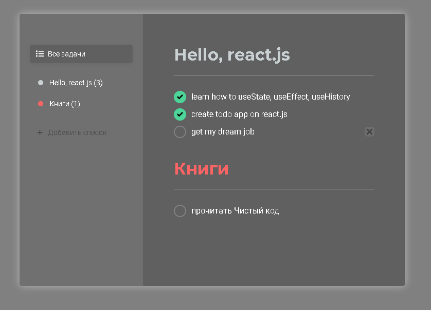

# react-todoList

## Preview

Простое ToDo приложение в стиле SPA на React.js
В качестве симуляции сервера используется [json-server](https://github.com/typicode/json-server). Для отправки запростов на этот сервер используется библиотека [axios](https://github.com/axios/axios).

Разрабатывая это приложение я научился пользоваться useState, useEffect, библиотекой __react-router-dom__ (BouserRouter, Route, useHistory)

Код написан криво и требует рефакторинга (возможно именно сейчас я этим занимаюсь(возможно)), но всё же это моё первое полноценное react-приложение.

### To start fake-json server on port 3001:
    npm run fake-json

